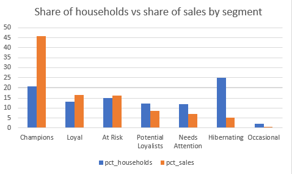

# RFM Customer Segmentation in SQL

Grouping 2,500 households of a US grocery store into customer segments, using 2.6 million loyalty-card purchases and MySQL.

**Author:** Varun Arora

---

## What is RFM?

RFM scores every customer on three things:

- **Recency:** how many days since their last shopping trip (fewer is better)
- **Frequency:** how many trips they made (more is better)
- **Monetary:** how much they spent in total (more is better)

Each score runs from 1 to 5, where 5 is best. The scores are then turned into named groups such as "Champions" and "At Risk".

## Questions answered(Hypothetical)

1. How much of total sales comes from the best customers?
2. Which valuable customers are drifting away?
3. Did marketing campaigns reach those customers?

## Key findings

- **The top 10% of households bring in 34.3% of sales.**
- **Champions (20.5% of households) bring in 45.7% of sales.** That is $3.68M, about $7,197 per household.
- **378 households are "At Risk".** They spent $1.31M (16.2% of sales), but on average haven't shopped for 34 days. Champions last shopped 2 days ago on average.
- **Campaigns already reached most of them.** 84.7% of At Risk households (320 of 378) got at least one campaign and still went quiet. Only 58 were never contacted.
- **Most households are still active.** 66.9% shopped in the last 14 days; 174 households (7.0%) haven't shopped in over 90 days.
- **Who they are (indicative).** Both Champions and At Risk households are most often aged 45–54. The most common income band is $50–74K for Champions and $35–49K for At Risk.

## Segment summary

| Segment | Households | % of households | Sales (USD) | % of sales | Avg trips | Avg days since last trip |
|---|--:|--:|--:|--:|--:|--:|
| Champions | 512 | 20.5 | 3,684,849 | 45.7 | 244 | 2 |
| Loyal | 328 | 13.1 | 1,335,084 | 16.6 | 164 | 5 |
| At Risk | 378 | 15.1 | 1,305,039 | 16.2 | 104 | 34 |
| Potential Loyalists | 305 | 12.2 | 684,319 | 8.5 | 65 | 2 |
| Needs Attention | 299 | 12.0 | 576,670 | 7.2 | 56 | 7 |
| Hibernating | 622 | 24.9 | 430,231 | 5.3 | 32 | 77 |
| Occasional | 56 | 2.2 | 41,270 | 0.5 | 21 | 2 |

Full table: [results/segment_summary.csv](results/segment_summary.csv)

## Recommendation

Most At Risk households were already contacted and still stopped shopping, so more of the same campaigns probably won't help. A better test is a **personal win-back offer** based on the products each household used to buy. Compare it against a small group that gets no offer, and track how many households come back over 8 weeks. At the same time, **look after the Champions** with loyalty perks, since they bring in almost half of all sales.

## How the whole project was done

1. **Loaded** the three CSV files into MySQL with `LOAD DATA LOCAL INFILE`.
2. **Checked the data first:**
   - Each row is one product, not one trip, so a trip = one distinct basket (276,484 baskets).
   - 18,879 rows with a sales value of zero were left out.
   - There are no calendar dates, only day numbers 1–711, so recency is counted from day 712.
   - Only 801 of 2,500 households have demographic data, so `LEFT JOIN` was used to keep every household.
3. **Built one row per household** with recency, frequency and monetary value, using a subquery.
4. **Scored** each value from 1 to 5 with `NTILE(5)` (500 households per score).
5. **Named the segments** with a `CASE` expression:

| Segment | Rule |
|---|---|
| Champions | R ≥ 4, F ≥ 4, M ≥ 4 |
| Loyal | F ≥ 4, R ≥ 3 |
| At Risk | R ≤ 2, M ≥ 3 |
| Potential Loyalists | R ≥ 4, F ≥ 2 |
| Occasional | R ≥ 4 |
| Needs Attention | R = 3 |
| Hibernating | everyone else |

6. **Answered the business questions:** segment value, sales concentration (`NTILE(10)`), campaign reach and demographics.

## Limitations

- **Campaign timing isn't known.** The data shows who got a campaign, not when, so this shows reach, not cause and effect.
- **Demographics are indicative only.** They cover 345 of 512 Champions and 136 of 378 At Risk households.
- **Score boundaries involve ties.** Many households share the same recency (for example 2 days), and `NTILE` splits ties at a score boundary arbitrarily, so a rerun could move a handful of households between segments.

## Files

| File | What it does |
|---|---|
| `sql/01_create_tables.sql` | Creates the database and tables |
| `sql/02_load_data.sql` | Imports the CSV files and checks row counts |
| `sql/03_explore.sql` | Data checks and decisions |
| `sql/04_rfm_base.sql` | Recency, frequency and monetary value per household |
| `sql/05_rfm_segments.sql` | 1–5 scores and named segments |
| `sql/06_insights.sql` | Business questions |
| `results/segment_summary.csv` | Exported segment summary |
| `results/segments_chart.png` | Chart of households vs sales by segment |

## Data

[dunnhumby – The Complete Journey](https://www.kaggle.com/datasets/frtgnn/dunnhumby-the-complete-journey) (Kaggle). The data files are not in this repo because `transaction_data.csv` is too big for GitHub.

**To rerun:** download the dataset, put `transaction_data.csv`, `hh_demographic.csv` and `campaign_table.csv` in a `data/` folder, update the file paths in `sql/02_load_data.sql`, then run the scripts in order from 01 to 06.

## Tools

MySQL 8, MySQL Workbench, Microsoft Excel
